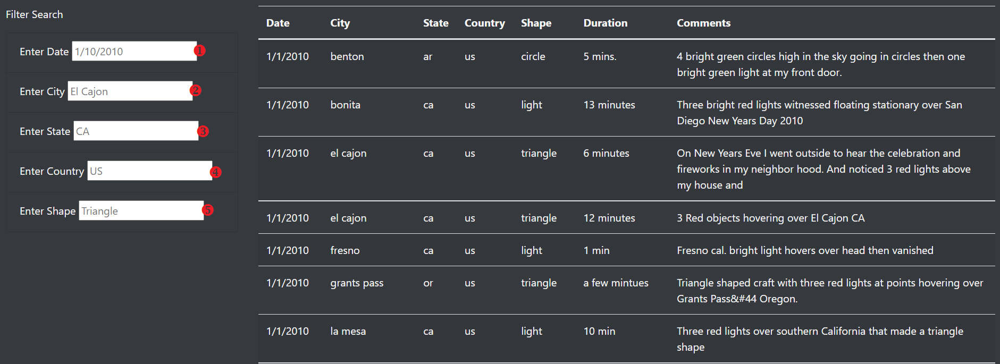
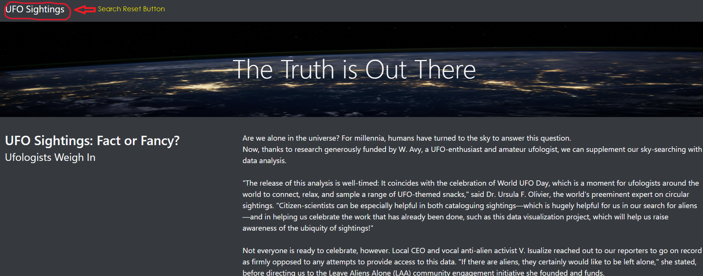

# UFOs
## Overview
This webpage and dynamic table were created to provide the user the ability to filter and anaylis the UFO sighting data. Using JavaScritp and HTML I created data filters to show the city, state, country and shape of each sighting. 

## Results 

The following webpage was created:
https://sarahcrozier.github.io/UFOs/

There are five search options:

This is an example of the results filtered by state:

## Summary
- Drawbacks
    - There is no logical way to know that the search reset button is actually at the top of the page. A button needs to be added that would make resetting the search critiria logical and user friendly. 

- Improvements 
    - The search results needed to be an exact match including capitals. I coded the search entries so even if the user used or did not use capitals they could search the database and produce results.  

    - Including a way for the user to create a printable document would be a useful feature to add.

    - An interactive map would make this webpage more dynamic and visually appealing to the user. 

